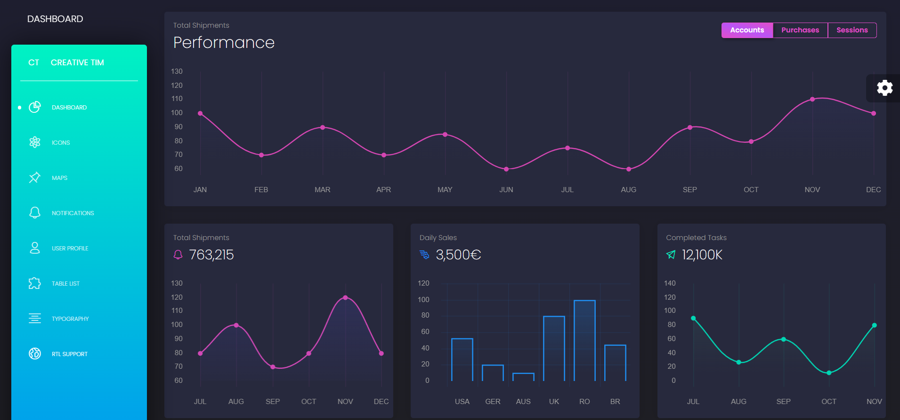

# 🌟 Coffee Shop RPG ☕ 🌟
Welcome to our humble coffee shop where we serve the finest coffee and cafe drinks in the world. For our coffee beans we use only the best offerd by coffee farmers around the world. Ladies and Gentlemen please enjoy your day with our special made coffee to your hearts desire. It needs to be said that we work for customer satisfaction and our staff are trained to serve you the best taste with the best manners. Now, The journey begins 🪶>>>

### Maktab 98 🚀

## 🔥 Programming Team 🔥
### Group 2 >>>
### Scrum Master: Alireza Arvin                 [GitHub Account](https://github.com/AradArvin)
### Team Leader: Mahdiyar kafaie khou           [GitHub Account](https://github.com/m-kafaiekhou)
### Developer: Zahra Mahjour                    [GitHub Account](https://github.com/zmahjour)
### Developer: Sevda Hayati                     [GitHub Account](https://github.com/arta16h)
### Developer: Mohammad Ali Soltan Hosseini     [GitHub Account](https://github.com/mohammadali127)

## Project Details 💻 👏	
This is a Django Fullstack Project and it features a website to order coffee in a coffee shop in tehran city(The Quest city). It uses django version 4.2.3 (The God of Frameworks) to bring all the new features into the code(The Pain and Suffering of Programmers). We used all the knowledge we gained so far (XP Gained) to code a website for the wise manager(The Demon Lord) who tasked us with this group project(Literally the Quest). the project tasks start with a general knowledge over the project structure(Buying Wepons and Healing Potions). As we learned from the details, first we needed to draw an ERD(World Map) then build the base of the project using django frame-work from there we had to choose our site interface template to style the site(Choose the way to procede with your quest). once all of these steps were done we could finaly start the main coding of the app. We bring to you our best, using all we learned from Maktab 98.


## Installation Guide

Since this project uses the django project technology I recommend you to read this part to properly set up the project.

- fork this project to your own repo by clicking on fork button in the top-right corner.


- clone the forked repo to you'r local storage >>>
    
    `git clone https://github.com/m-kafaiekhou/Group2Project.git`


- make a virtual environment for the django project >>>
    
    `python3 -m venv .venv`


- activate the venv like this.

    `source .venv/bin/activate`


- now you can install the required packages using this method. in the root directory of the project:

    `pip install -r requirements.txt`

this will automatically install all the tools and packages needed for the project, so it could work.(Django will be installed as well)

> Now you are ready to start browsing this project.

## Project Sprints
With all said and done we now start the SCRUM sprints of our project >>>

### Sprint 1 Start with Basics & Build Design

#### ERD(Entity Relationship Diagram)
Everything starts with a good planning, in our case: we programmers need to draw the ERD for our project so we could configure the base build of our database which alows us to build the program upon it. you can see our team effort below. 


#### Template 
Choosing a good template was a group effort as well, there were so many obstacles but we could overcome them and choose a good template.


But as you just realized we need to customize this template since it is actually too random. the reason why we chose this is It's simplicity and beauty. Lets hope this is going to work. (^-^)


#### Project Setup
In this step the setup for the project is configured and we begin to get into code. The starting apps are:
- staff
- coffeeshop


#### Git Init
The git repo was initiated and the files of the project were pushed on the github.

#### Basic Models 
The first build of models in the project are done. using django models module, the basic models that got accepted by our teachers were: 
- Staff(User)
- Order
- OrderItem
- CafeItem
- Review
- ParentCategory
- SubCategory

#### Basic Templates
The Basic layout of the site templates was created in this step(django tags & starting templates).

#### Authentication
A very tricky and chalenging step in the first sprint of the project but it was done with Style and Elegance. The custome authentication had to be done using phone number. At first it was thought that we need a complete backend for User in this project but then we realized that it wasn't the case, We only needed to customize the username to phone-number.

#### OTP(One Time Password)
In the process of the project a problem was surfaced, which was the security of the user accounts and trust issues of the project. So it was decided to implant an OTP system to solve this problem. This system sends a 4-digit one time password to the user which then, the user can use to authenticate into website. but since it was too dificult for our first sprint we kept it for the next one.

#### First Theme Setup
It was time to finally bring the site up with some styles in it. So we thought to do these templates using the chosen theme for the website:
- base.html
- navbar.html
- header.html
- footer.html

#### Gathering Data for the Website
We just realized that we have no idea about what we are going to put on our cafe website.< we are programmers not coffee makers >. So the solution was the answer we always get from our teachers: Go search for it yourself (0_0).

#### Views & Templates (FBVs)
At first we thought we had to use generic class based view's, Yet as you can guess we were told to use function based views.
As you can guess the pages were brought up one after the other. Starting with pages, first came the home page, then the menu page, and then the high difficulty ones came... they were called checkout page and cart page.

FBVs for Pages:
- home.html
- menu.html
- checkout.html
- cart.html

#### Cookies & Sessions
A realy hard task in the journey, not many could survive this. But your dear bros were just defeted as expected.
cookies were done but it was done blindly without having any view functions written so we had to change them alot.
it works so dont touch it!


### Sprint 2 Progressing to the Next Step(fixed what we could from sprint1)

#### CBV View & template(staff panel)
Now we just realized that we need to change all our function based views to class based views :|
So we used some imports and now all the views are class based.

#### Menu SetUp
The menu is the most important part of a coffee shop so the design is important. with the ready template we used, we already had a menu page so all we had to do was customize this page to meet our need's.

#### OTP 
AS it was seen before we attempted to do this but we failed so we kept it for this sprint. and now its done and ready to be represented.

To describe how it works: when a user logins to their account an otp is shown in the terminal so the user can use it to login to their page.(Not a Good Method. We know.) 

#### Shopping Cart (Cookie & seesions)
Since we had java script resources this week we realized it would be a good idea to implement cookies using java script so one of our team members who could do JS code, took up the task and it turned out to be very good in the end.

#### Fixes
There were Some big problems. first our template was not very good so we had to change it and our site was lacking in every aspects. so the template of the whole site was changed.


### Sprint 2 FixLog

#### LvL 1
- Staff panel filter.
- Add items.
- Edit orders.
- Accept or decline orders.
- Log out for staff.

#### LvL 2
- Auto complete(AJAX).
- Add order history.
- Slug for cafe items.

#### LvL 3
- Detail for Menu items
- Slug for urls

#### LvL 4
- New Template
- Styling of all website pages

> All Done

### Sprint 3 Website has More Details and its Only one Sprint Away from Completion

#### Dashboard page for staff panel(template)
We didn't have a staff panel dashboard before. so the solution was to find a free template on line which was a good choice since it was so beautiful. A good choice for all of our charts.
Dashboard template: Black-Dashboard by Creative Tim




#### Admin Panel Customize
This was one of the main tasks we had. its about changing the colors and ordering of models in admin page, plus adding filters and stuff like that. Which was done very well.

#### Manager Dashboard
It is customary to give the manager extra permissions and extra charts. this is achived by the usage of django permissions.
It is a good tool to make permission groupes and add people to them.

#### Generic Class Views
Again we had to change our views. this time it was generic class views, which are a step higher than class based views but they cannot be used anywhere. GCBV best usage is for ListViews and DetailViews.

#### OTP
As it was before(Getting otp from terminal), the otp was not installed properly so that users could make the best use of it. it was useful on develobpement levels. So the team thought of getting a messaging api named `melipayamak`. This was a good idea, and it worked in our favor. Now all you need to do is enter your phone number and the 4-digit otp will be sent to your phone automatically.  

#### Dynamic Webpage Interface Styling
This was a step in the beginning sprints but since we didn't have any prior knowledge about this method and we had to change our website template entirely, it was a good choice to keep it for this sprint. Right now the website interface is interactive and it could be redesined at any time.(Banners, texts and numbers).

#### Improve Website Interface
Since the change of template the website was good enogh but it still had some bugs so this is were we started to find the interface bugs.

#### Responsive Website
Responsive means, that if the size of display changes the website should still be elegant and its elements in place and with style and order. this step was done using bootstrap and css styling.

#### FixLog Sprint 3

#### LvL 1
- Some chart views weren't working
- The staff panel templates needed to be fixed

#### LvL 2
- Menu needed a redesigning
- We needed more charts

> These fixes were done

### Sprint 3 The Final Steps and Finishing Touches

#### Customer Behavior
This is all about analizing the customer behavior data to then use it with charts.

#### Analytics dashboard for the manager
Using a dashboard(gui tool) and its charts to show the customer behavior data to the manager.

#### Downloadable Analytics Data
A very good feature for the manager this way the analitics data can be accessed from almost anywhere. To do this again the help of JS is required. Now the data of the charts can be downloaded with the csv format.

#### Permissions
The permissions for the staff is finally set and each lvl of staff can only see the data they have permissions for.

#### Manager permissions
Another part of permissions. to give a wider access to the dashboard for the manager.

#### Write Unit Tests for Coffee Shop Project
One of the most important parts about any project is unittests which is performed by the help of TestCase. In this step the code of the project is tested to find any buggs in code or find the changes in project more easily.
Our goal was to reach the test coverage of 95%.

An example:

    ```
    def test_sales_by_time_of_day_data_start_date_smaller(self):
        self.client.login(phone_number='09030001122', password='1X<ISRUkw+tuK')
        start_date = "2023-8-10"
        end_date = "2023-8-20"
        url = reverse("daily-time-sale")
        data = {'start_date': start_date, 'end_date': end_date}
        response = self.client.get(url, data=data)

        expected_data = {
            "title": f"Sales by Time of Day Between {start_date} and {end_date}",
            "data": {
                "labels": [],
                "datasets": [{
                    "label": "Amount (T)",
                    'borderColor': '#d048b6',
                    'borderWidth': 2,
                    'borderDash': [],
                    'borderDashOffset': 0.0,
                    'pointBackgroundColor': '#d048b6',
                    'pointBorderColor': 'rgba(255,255,255,0)',
                    'pointHoverBackgroundColor': '#d048b6',
                    'pointBorderWidth': 20,
                    'pointHoverRadius': 4,
                    'pointHoverBorderWidth': 15,
                    'pointRadius': 4,
                    "data": [],
                }]
            }
        }
        self.assertAlmostEqual(response.json(), expected_data)
    ```

Which tests the sale by time of day chart data between to dates. start date and end date...

coverage: a testing tool for django which tests the test files and returns reporsts in html, or on terminal. 

#### Project Deployment
It is finally time to deploy your data on a platform like heroku or aws, so that the website could be accessed online frome anywhere in the world.

#### Documentation(README)
This is the finall step.
You need to Document the project and detail every part of it so that it could be used to understand every detail of project.
This is normally done by installing the sphinx python-django package so that it would make a documentation of your project. of course you could add more detail to it.

    `pip install sphinx`

Then make a directory in the project root named `docs`. cd to this directory and then use this command to start sphinx process.

    `quickstart sphinx`

this will then make some files in the `docs directory`. these files are used for project documentation. the main file that we need to use is `index.rst` which is the main file that holdes the documentation of the project. you can add more detail to this file and when you are done, you can use this command:

    `make html`

to make a html file from your documentation.
the next steps are to make a documentation repository for your repo and getting your documentation on read the docs which its tuturial can be accessed from [Here.](https://docs.readthedocs.io/en/stable/tutorial/index.html) 

The End